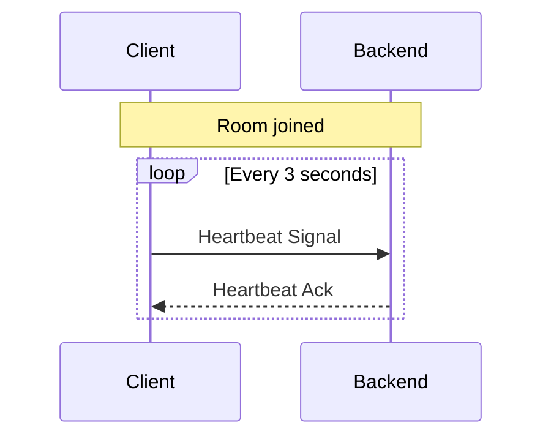

# Heartbeat

Heartbeat is a subsystem for room that helps backend to track the user presence. Any user which are not send heartbeat signal for more than 10 seconds will be considered as offline and the resource allocated will be released.

## Interval

Heartbeat shall be sent every **3 seconds** between the join and leave signal for each rooms. Each room's heartbeat is count separately.

## Sync Latest Room Publisher List

Heartbeat Ack will contain the latest room publisher list including their id, video and audio status. The client shall update the local state accordingly.