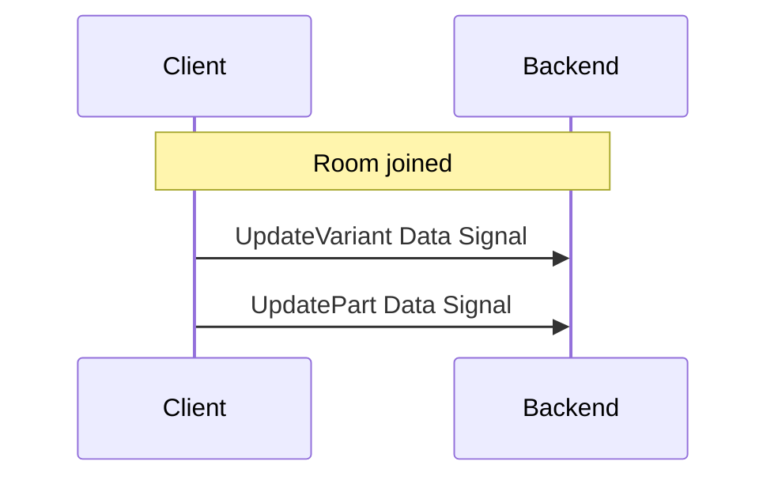

# HLS

We use hls to provide a cost-effective live stream service with medium latency requirement. Different from the traditional live stream service, we move the encoding and package process from the server to the client. Our hls server serves data caching and playlist composition.

## Low Latency HLS

This is a improved protocal from the original HLS. It reduces the latency of HLS by using smaller segment(aka, part), improve request polling and reducing extra round trip for playlist fetching. [This is a short introduction of low latency HLS.](https://developer.apple.com/documentation/http_live_streaming/enabling_low-latency_hls)

The lowest latency we can achive so far is around 2-3 seconds delay. However, in order to provide a better user experience, the client shall keep **5 second** delay when playing the stream.

> **Note**: There is another community approach low latency HLS specification available before Apple released theirs in 2019. Our low latency HLS is based on Apple's specification.

## Streamer

### Uploading Data

Because we are generating media package from the client, we need to send those data along wit some meta data to the backend. The format of the message is called **Data Signal**.

### Tracking

The client shall track the progress of the stream and save the status of part uploads as the reference for network performance. The upload delay is provided via http response.

### Poor Network Performance

In case of poor network performance(upload delay greater than 700 ms for 10 seconds), the client shall notify the user and close the stream.

## Viewer

Most standard HLS player will be able to play our hls stream since our stream is backwbackward compatible. However, you may need to looking for the player which support the Apple Low Latency HLS specification to get max performance.

### Debugging

For debugging hls, we recommand use Apple [HTTP Live Streaming Tools](https://developer.apple.com/download/all/?q=live). It provide command line tool for analyzing the hls stream. Please read its readme for more information.