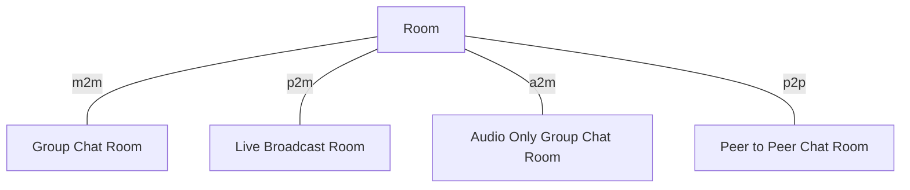
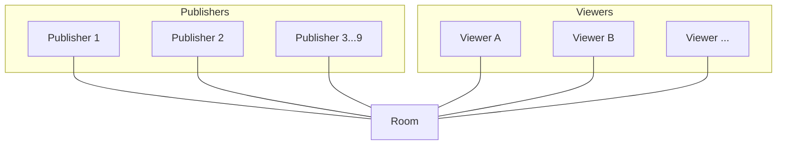
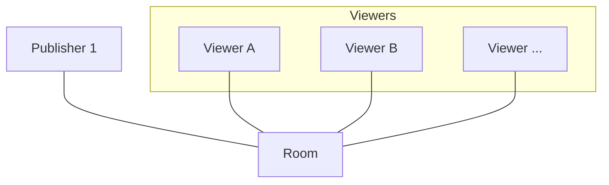
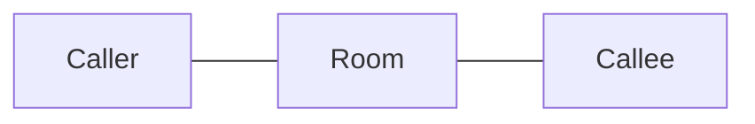

# Room

Room is the most fundamental logic unit in our stream service. It's the base unit which provide the service. There are different types of rooms.

## Group Chat Room(m2m)

Group Chat Room is a many to many room which implements with webrtc. Only publishers can publish video and audio.

### Room capacity
The max publisher limit is 9 persons and the viewer is unlimited.

### WebRTC
Each publisher stream can be in the same webrtc server or in different webrtc server. The client need to make a webrtc connection to each publisher stream.
> **Note**: Currently publisher id is used to locate the stream and it's equivalent with user id. In the future, we publisher id will be session id because a user can have multiple streams in the same room.

### Ownership

Oldest publisher in the room is the owner. When the current room owner left, the next oldest publisher will become the owner automatically.

### Become a publisher

The publisher status is granted in two conditions:
1. The user who create the room become the publisher by default.
2. Viewers can be promoted to publishers via raising hand. The owner of the room(oldest publisher in the room) will recieve a publish request message. And if the owner send back publish accept signal, then the viewer will become a publisher. 

### Kick

The publisher can kick viewers or other publishers out of the room.

## Live Broadcast Room(p2m)

Live Broadcast Room is a one to many room which implements with HLS. There is only one publisher in the room.

### Room capacity
Only one publisher is allowed and the viewer is unlimited.

### HLS
The server will provide HLS playlist. We are using low latency HLS playlist according to the Apple's HLS specification. The url template is `\(endpoint)/\(stage)/live/\(userId)/\(streamId)/playlist.m3u8`.

For more detail pls reference to HLS page.

### Kick

The publisher can kick viewers out of the room.

## Audio Only Group Chat Room(a2m)

Audio Only Group Chat Room is a many to many room like Group Chat Room but only allow for audio.

All concepts is the same as Group Chat Room. 

## Peer to Peer Chat Room(p2p)

Peer to Peer Chat Room is a one to one room which implements with webrtc. It represents a voip call between two users.

### Room capacity
Only two publishers are allowed and no viewer.

### WebRTC
WebRTC connection is going from caller to callee directly. The server role is to forward the signal to each peer.
> **Note**: The callee shall send webrtc offer signal to the caller. When the caller starts the call, a p2p room is created. When the callee join the room, he will obtain the caller id and use that to send webrtc offer signal