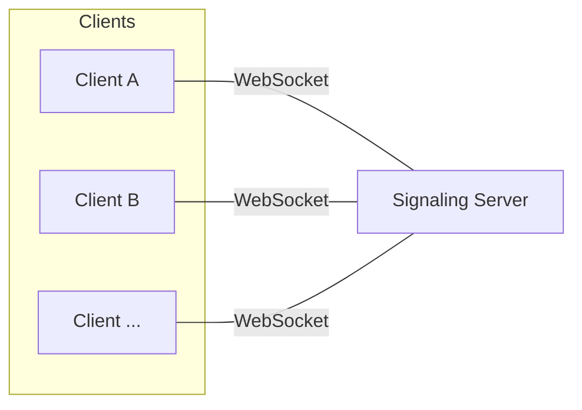
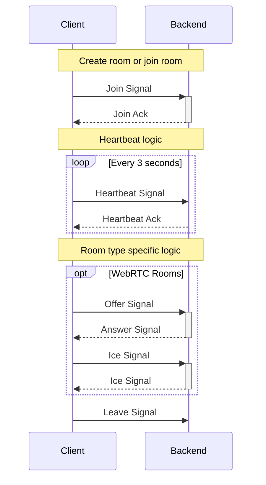
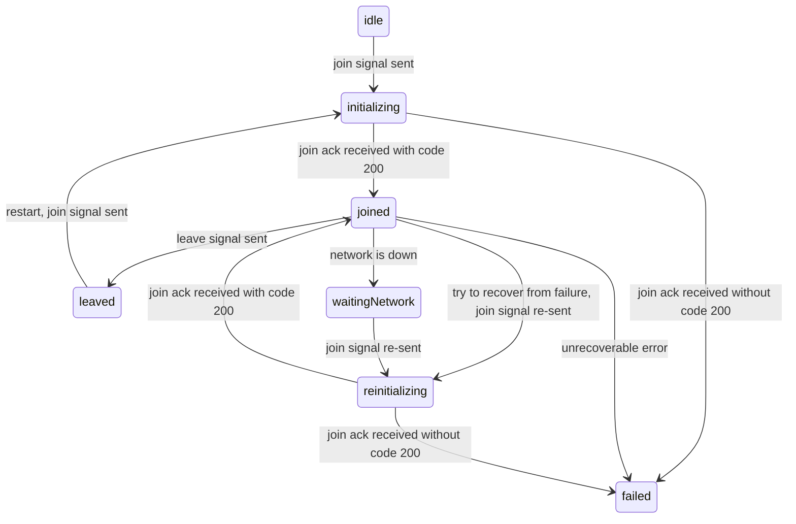

# Signaling

The way to interact the rooms is via signaling. Clients will need to open a websocket connection to the signaling server.



## WebSocket

The client can use any standard websocket client library to connect to the signaling server. Our signaling server is based on aws apigateway so it's [limiations](https://docs.aws.amazon.com/apigateway/latest/developerguide/limits.html#apigateway-execution-service-websocket-limits-table) apply to us.

### Keepalive

The apigateway websocket has a 10 minutes idle connection timeout. To keep the connection alive, the backend will send keepalive signal to the client to keep the connection alive. Client doesn't need to send back anything in this case.

### Reconnectivity

The apigateway websocket has a two hour maximum connection duration timeout. Therefore, the client need to reconnect to the signaling server if the connection is down and save the signals while reconnecting.

### Payload limit

WebSocket frame size: 32 KB

Message payload size: 128 KB

Because of the WebSocket frame-size quota of 32 KB, a message larger than 32 KB must be split into multiple frames, each 32 KB or smaller. If a larger message (or larger frame size) is received, the connection is closed with code 1009.

> **Note**: Because the control signals are small in general, usually you don't need to worry about splitting the frames. However, for the most open source websocket client, we saw they will package all data into one frame. So this is something you may need to watch out for.


## Room Signaling

Despite the different room types, there are set of behaviors that they share in common.



### Naming Convention

Cliend initiated message: signal

Backend initiated message: ack

> **Note**: In case of webrtc signaling, the backend will be forward the signal from user A to user B. Although the message is sent by the backend, the signal is still initiated by the client so they are still called signal.

### State

The client shall implement the following state machine for room signaling.



```
idle: The initial state
initializing: Join signal sent, waiting for room info
joined: Room joined, start engine(webrtc, hls) connection
leaved: Room leaved, clean resources
waitingNetwork: Network is down, waiting for network recovery
reinitializing: Try to recover from failure, join signal re-sent
failed: Unrecoverable error
```

### Create Room

When sending the join signal, the signal need to contain `roomCreating` field if this is a new room. By default, join signal will only join the room and an error will be returned if the room doesn't exist.

### Leave and Heartbeat

The leave signal need to send so the backend can clean the resources. In case of no leave signal, the backend will rely on the heartbeat signal to judge if the client is still in the room.

## WebRTC Signaling

Our signaling server also serves as webrtc signaling server. It will handle the webrtc specific messages such as offer sdp, answer sdp, ice candidate and etc.

## Data Signaling for HLS

> **Note**: Data signaling is transimitted via http.

In our live stream system, the streamer is responsible for encoding their stream to hls parts/segments. Then the encoded media data will be sent with meta data, packaged in our data signal format, to our backend endpoints via http. 
