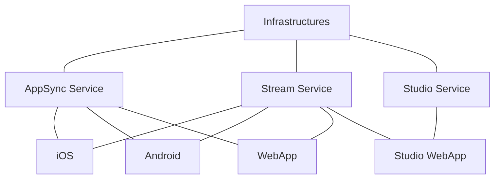

# Roadmap 072622

Current status of the backend and what we want to accomplish next.

### [Infrastructures](https://github.com/MobWorx/infrastructures)
This repo contains the shared resources those are needed across the microservices. For example, we setup an aws eventbridge in this repo and shared with all other microservices. In term of database, we use postgres compatible aws serverless aurora v1 and use [flyway](https://flywaydb.org/) to do the migration. we wrote some scripts to run flyway which is in [here](https://github.com/MobWorx/operations).

### [AppSync Service](https://github.com/MobWorx/appsync-service)
This is our api service for iOS, Android and web app. We only serve GraphQL endpoint and the requests are handled by aws appsync. It contains most of the business logic.

### [Studio Service](https://github.com/MobWorx/studio-service)
This is our backend service for studio. It will be incharge of spawn new studio session for video muxing and push to other platforms.

### Staging
For backend, we have two environments, staging and production. There is no development environment for now, all development changes and experiments shall deploy to staging environment. We are looking for to have development environment in the future.

### Tool
`serverless framework` is our main tool for microservice deployment and we use `serverless framework pro` for CI deployment. Currently, the commits in appsync-service's master and stream-service' master will trigger the CI deploys to staging environment. For task management, we will use Github Project to track.

## Goal

For our current phase, our main goal is to roll out of a production ready backend with m2m, a2m, p2m, p2p features, and studio production ready backend for stream aggregation. The services shall scale up and down automatically, self-recover from failure and maintain high availablity.

## Refactor

There are some work we need to do before we move forward.

### Aurora migration
We are using aws aurora serverless v1 and we need to migrate to aurora serverless v2.

### Regroup studio services
There are some services which I think shall be merged in [studio service](https://github.com/MobWorx/studio-service), such as [studio infrastructure](https://github.com/MobWorx/studio-infrastructure).

### Serverless framework node version problem
Currently, only node 15 works for deploying. When deploying with node > 15, all lambdas will crash. Seem related with serverless webpack plugin we use.

### Check if RDS proxy is used everywhere
We shall use RDS proxy everywhere when we access the database. Add it, if we are not using it.

## Testability

Test is necessary for robustness and demonstrating the task is done. We will look for test run when we do the code review. Starting with the task you are working on right now(such as cascading) and later we can add tests for the older features.

## Scalability
In case of cluster, they shall scale up and down automatically and cascading for media server.

### Local testing
If possiable, we would like to run some tests in local environment. This meant that we will need to simulate some of the backend service in local setup.

## Timeframe

We want to have a production ready backend by the mid of September. We expect refactor stuffs can be done next week and we are ready to discuss your test solutions by next week as well.